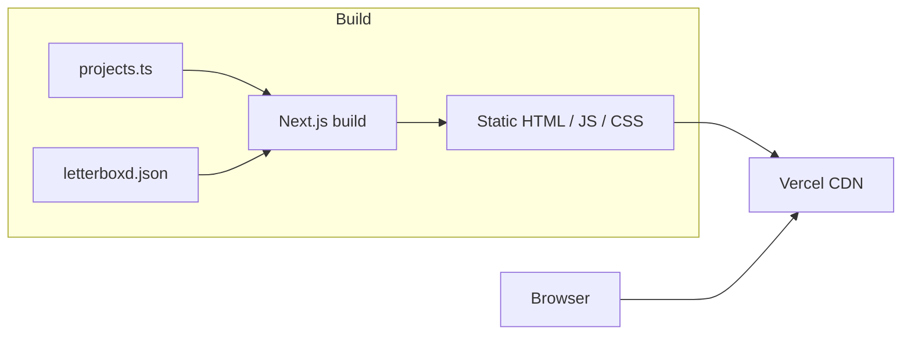

# Hub

Personal homepage and project showcase. Built with Next.js, Tailwind CSS, and shadcn/ui.

**Live site:** [https://owenw.vercel.app](https://owenw.vercel.app)

## Stack

- **Framework:** [Next.js](https://nextjs.org) (App Router, static export)
- **Styling:** [Tailwind CSS](https://tailwindcss.com)
- **Components:** [shadcn/ui](https://ui.shadcn.com)
- **Testing:** Jest + React Testing Library (unit), Playwright + axe-core (e2e)

## Architecture



## Development

```bash
# Install dependencies
pnpm install

# Start development server
pnpm dev

# Run unit tests with coverage
pnpm test:coverage

# Run e2e tests
pnpm test:e2e

# Build for production
pnpm build
```

## Deployment

- **Production:** `main` branch auto-deploys to [owenw.vercel.app](https://owenw.vercel.app)
- **Preview:** Feature branches get preview URLs via Vercel

## License

MIT
